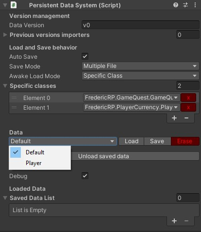

# Persistent data system

The PersistentDataSystem is an easy and working save system.



## Usage

1. Put the script on a gameObject or use the prefab provided.
2. Add the classes within the *specific classes* list for the system to be able to find and load automatically those data.
3. When the game is launched, all existing data from those classes will be loaded.

To retrieve the loaded data, use the following sample code:
```C#
PersistentDataSystem.Instance.GetSavedData<MyAwesomePlayerData>()
```
This data can be modified, the system will save it when required (see auto save).

The **player data** (aka its progress in the game) is saved under the *persistentDataPath* and the **default data** is saved (in the editor) and loaded from the *streamingAssetsPath*.

**Beware**: The available specific classes are updated automatically when Unity has finished compiling. To be present in that list, a class must derive from the PersistentDataSystem *SavedData* class.

### Auto save

Ticking auto save mode triggers the saving process when the application is *paused* or *quitting*, based on Unity events perception.

If you need to save when you want, call the *SaveAllData* method on the *PersistentDataSystem.Instance* (it's a singleton).

```C#
PersistentDataSystem.Instance.SaveAllData();
```

The load is almost the same, depending on which class you want to load. It can be all types that derive from SavedData, your specific type, or the one specified in the inspector:

```C#
PersistentDataSystem.Instance.LoadSpecificClass();
```

### Save mode

Using *single file*, all data are saved in a single file.
Using *multiple file*, each saved data type is saved in a different file. This allows more flexibility but could take more disk space.

### Awake load mode

Using *None*, nothing is done to load the data.

Using *Specific classes* (by default), only specific classes will be loaded.

Using *All saved data*, system will attempt to load any kind of saved data it is able to find in the system.

### Creating a default save

From the inspector, you can load/save/erase the default and player data (only the one linked to the editor during play mode).

To create a default save, be sure to:

1. select the *default* item in the dropdown menu, 
2. specify some classes in the *specific class* list,
3. press the *load* button, it will create a blank data for each *specific class*.
4. You can then fill the detail you want and hit the *save* button.

## Advanced

### Serialization

You can implement ISerialization or IFullSerializationControl to fully control the serialization process.

### Events

Be sure to add your actions on the event delegates before loading or saving if you want them to be triggered.
If you need to be triggered on first load with specific classes, set the awake mode to *None* then link your actions, then call *LoadSpecificClass* method on the *PersistentDataSystem.Instance* (it's a singleton).

- OnDataSaved<SavedData> : this action is called when a file is saved.
- OnDataLoaded<SavedData>: this action is called when a file is loaded.
